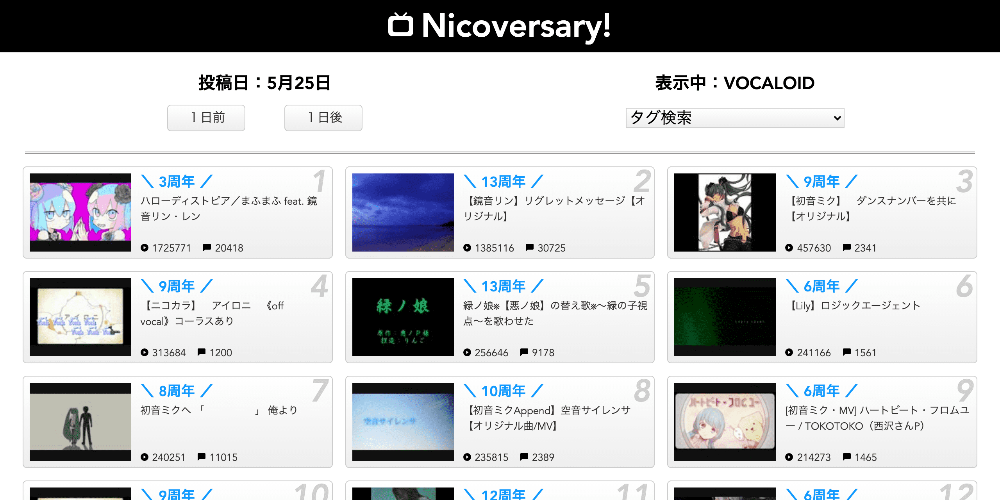

# Nicoversary!

ニコニコ動画の動画では，「〇〇周年記念にまた見に来た」という内容のコメントを見かけます。

特定の日付に投稿された動画を再生数順で調べられたら便利だと思い，作りました。

匿名で閲覧できる静的Webアプリとして再構築したので，GitHub Pages に配置するだけで公開できます。

公開中: https://kg9n3n8y.github.io/

## GitHub Pages で公開するには

1. リポジトリ設定で Pages のソースを `main` ブランチ（もしくは任意の公開用ブランチ）の `/`（ルート）に設定します。
2. デプロイ後に `https://<username>.github.io/<repository>/` にアクセスするとアプリが利用できます。

ローカル確認はブラウザで `index.html` を開くだけで可能です（CORS 設定により一部ブラウザは `file://` を禁止するので，簡易サーバーを立てると確実です）。

## 参考イメージ

## 使い方

- 画面上部の投稿日表示は現在表示中の日付です。「１日前」「１日後」を押すと同日の別年の動画を含めたランキングを再取得します。
- タグのプルダウンで代表的なタグを選ぶと，そのタグに限定した検索が行えます。「なし」を選ぶとタグ条件を外します。
- 各カードをクリックするとニコニコ動画の視聴ページ（別タブ）が開きます。
- 一番上のタイトルロゴをクリックすると当日の検索に戻ります。

## URL で直接条件指定

クエリパラメーターで検索条件を直接指定できます。

- `?date=2021-05-24` で日付を指定
- `?tag=VOCALOID` でタグを指定
- `?date=2012-10-12&tag=東方Project` のように組み合わせも可能です

検索対象は 2008-01-01 から 2025-12-31 まで、かつ 10,000 再生以上の動画に絞り込んでいます。  
クエリが大きくなりすぎる関係で 2026 年以降の検索はサポートしていません。

## 開発メモ

- 使用技術: HTML, CSS, JavaScript (Vanilla)
- データ取得: ニコニコ動画 『スナップショット検索API v2』

API ドキュメント: https://site.nicovideo.jp/search-api-docs/snapshot

著作権は放棄しませんが，改良してより高機能なものを作るなどは歓迎します。
